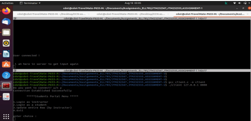
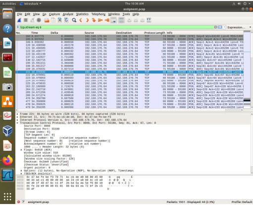

 Following tasks have been performed
Client will connect to server and logon through username and password pre-stored on
server. Server will
refuse connection without proper authentication.
If client is logged on using 'instructor' as username, it will have access to marks of all
the students in the class.
If client is any other user '<username>' (i.e. client is student) it will have access to
his/her marks only.
Client (student) should be able to get information about:
o His/her marks in each subject
o Aggregate percentage
o Subjects with maximum and minimum marks
Client (instructor) should be able to get information about:
o Marks (individual and aggregate percentage) of each student
o Class average
o Number of students failed (passing percentage 33.33%) in each subject
o Name of best and worst performing students
Instructor can update the marks of any student if he/she finds
a bug (or need for correction). Therefore, create a menu having option ‘Update’
for ‘Instructor’ login to update marks of a particular student in a subject.
Create ‘student_marks’ file that contains marks of each student and is accessed by
server for responding to client queries.
Create ‘user_pass’ file to hold data for usernames and passwords (with at least 20
users). This file is accessed by server for authentication
Create menu to select required information from client, either at client side or server
side.
Using Wireshark, analyse packet size and frame size in different TCP/IP layers. Also
trace the communication path between client and server machines and find the
number of hops used for communications. Comment on all the observations.

Client
A client is a program that runs on the local machine requesting service from the server. A
client program is a finite program means that the service started by the user and terminates
when the service is completed.
The steps involved in establishing a socket on theclient side are as follows:
1. Create a socket with the socket() system call
2. Connect the socket to the address of the server using the connect() system call
3. Send and receive data. There are a number of ways to do this, but the
simplest is to use the read() and write() system calls.
Server
A server is a program that runs on the remote machine providing services to the clients.
When the client requests for a service, then the server opens the door for the incoming
requests, but it never initiates the service.
A server program is an infinite program means that when it starts, it runs infinitely unless the
problem arises. The server waits for the incoming requests from the clients. When the request
arrives at the server, then it responds to the request.
The steps involved in establishing a socket on the server side are as follows:
1. Create a socket with the socket() system call
2. Bind the socket to an address using the bind() system call. For a server socket
on the Internet, an address consists of a port number on the host machine.
3. Listen for connections with the listen() system call
4. Accept a connection with the accept() system call. This call typically blocks
until a client connects with the server.
5. Send and receive data

Algorithm and Application
1. First server will ask that if you are a student or an instructor or an instructor who can
change student marks.
2. If you are a student then:
1. The client sends a username and a password to the server.
2. The server gets both these data and checks whether this combination is valid or not.
3. If valid server sends authentication to the client.
4. After authentication server gives the information about the client(student) his/her
marks in each subject, aggregate percentage and subject with maximum and minimum
marks.
3. If you are an instructor:
5. Then server will ask the master id and master password.
6. After instructor sends the master id and master password server will check if id and
password is valid or not.
7. If valid server will send authentication to the client.
8. After authentication server will send the Marks (individual and aggregate percentage)
of each student, Class average, Number of students failed (passing percentage
33.33%) in each subject and Name of best and worst performing students.
4. If client want to change the marks of the students or want to update the marks of an
student then server will ask for master id and master password.
5. After server authenticate the master id and master password the instructor(client)
can change or update students marks.
6. We are saving all the student id and student password in a file named usidpasid.txt and
students marks in marks.txt and instructors id and password in instructor.txt.
7. We use fopen command to open the file and use of pointer to point that file as
 fp =fopen(”filename”, ”r + ”) and r+ stands for read and write both in a file.
8. Then we sends the first line to an array as fgets(array, 80, pointer).
9. Then we break the students id and students password using while(arrayname[i]! =0−0)
and check using strncmp for both id and password.
10. Then we print the marks by just checking the name of the student.
11. We also use Switchcase command for the choices that we are a student or an instructor or
we want to update the students’ marks.
12. While updating the marks use have used fseek and fprint command.

